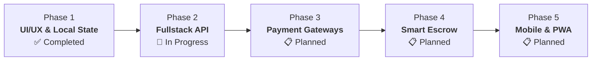

# 🪙 TrackPal (Schedly)

> **Modern Rotating Savings & Credit Association (Paluwagan / ROSCA) Platform**  
> Build financial discipline, pool savings transparently, and automate payout rotations with peer trust scores and digital receipt tracking.

[](https://react.dev/)
[](https://vite.dev/)
[](https://tanstack.com/router)
[-000000?style=flat-square&logo=nextdotjs&logoColor=white)](https://tanstack.com/start)
[](https://tailwindcss.com/)
[](https://laravel.com/)
[](https://www.php.net/)
[](https://www.typescriptlang.org/)
[](LICENSE)

---

## 📖 What is TrackPal?

In the Philippines and many cultures worldwide, informal community savings groups have been the heartbeat of personal finance for generations:

- **🇵🇭 Paluwagan** (Philippines)
- **🇲🇽 Tandas** (Mexico & Latin America)
- **🇬🇭 Susu** (West Africa & Caribbean)
- **🇮🇳 Chit Funds** (India)
- **🇰🇷 Kye** (Korea)
- **🇨🇳 Hui** (China)

In a traditional *Paluwagan*, a group of friends, family members, or colleagues agree to contribute a fixed amount of money (*hulog*) on a regular schedule (daily, weekly, or monthly). In each cycle, one member receives the entire lump-sum pooled pot (*sahod*), rotating until every member gets their turn.

### The Problem
Traditional Paluwagan relies on:
- ❌ Chaotic group chats flooded with unorganized payment screenshots.
- ❌ Vulnerable paper notebooks or manual spreadsheets prone to errors and loss.
- ❌ Awkward collection reminders and delayed payments.
- ❌ Broken trust and financial default when someone claims their payout early and disappears.

### The Solution: TrackPal
TrackPal digitizes community savings into a **transparent, high-accountability platform**:
- 🌻 **Automated Sahod Rotation**: Crystal-clear queue of who receives the pot next.
- 💳 **Digital Hulog Tracking**: Log GCash, Maya, or bank transfer reference numbers with receipt proof.
- 🛡️ **Peer Trust Scores**: Public reputation ratings (0.0 to 5.0) that reward timely contributors.
- 📅 **Interactive Financial Calendar**: Stay on top of contribution deadlines and collection dates.
- 🌓 **Tactile Swiss Bento Interface**: High-contrast, glanceable financial dashboards with zero clutter.

---

## ✨ Key Features

| Feature | Description |
| :--- | :--- |
| **🌻 Sunflower Bento Hero** | An eye-catching Swiss-style payout hero card highlighting the next *Sahod* recipient, countdown, cycle progress, and pooled funds. |
| **🔄 Rotation Roster** | Real-time cycle management tracking who has collected (`paid_pot`), who is receiving now (`current_pot`), and who is waiting (`waiting_pot`). |
| **🧾 Multi-Channel Receipts** | Payment modal supporting GCash, Maya, and BDO Unibank with reference number recording and proof-of-payment image attachments. |
| **🛡️ Peer Trust Scores** | Algorithmic trust ratings reflecting on-time payment history and completed cycles to keep communities safe and accountable. |
| **📅 Visual Financial Calendar** | Schedule inspector highlighting payout days, upcoming *hulog* deadlines, and cycle milestones with date-based filtering. |
| **👥 Circles & Social Directory** | Discover, create, and join savings circles tailored for office teams, family emergency funds, or business capital pools. |
| **🌓 Swiss Design System** | Thoughtfully crafted high-contrast design system featuring Sunflower Yellow (`#F5B800`) accents, dark/light themes, and WCAG AA accessibility. |

---

## 🛠️ Technology Stack & Documentation

### Web Frontend (`/web`)

| Technology | Category | Purpose | Links |
| :--- | :--- | :--- | :--- |
| **[React 19](https://react.dev/)** | UI Framework | Component architecture & concurrent rendering | [react.dev](https://react.dev/) |
| **[Vite 8](https://vite.dev/)** | Build Tool | Instant HMR development server and asset bundling | [vite.dev](https://vite.dev/) |
| **[TanStack Start](https://tanstack.com/start)** | Fullstack Framework | Server-Side Rendering (SSR) powered by Nitro server | [tanstack.com/start](https://tanstack.com/start) |
| **[TanStack Router](https://tanstack.com/router)** | Routing | Fully typesafe, file-based routing and navigation | [tanstack.com/router](https://tanstack.com/router) |
| **[Tailwind CSS](https://tailwindcss.com/)** | Styling | Utility-first styling with custom Swiss Bento tokens | [tailwindcss.com](https://tailwindcss.com/) |
| **[Lucide React](https://lucide.dev/)** | Icons | Crisp, modern UI iconography | [lucide.dev](https://lucide.dev/) |
| **[Motion](https://motion.dev/)** | Animation | Fluid micro-interactions and onboarding carousel | [motion.dev](https://motion.dev/) |
| **[Better-Auth](https://better-auth.com/)** | Authentication | Comprehensive authentication framework | [better-auth.com](https://better-auth.com/) |
| **[Drizzle ORM](https://orm.drizzle.team/)** | Database ORM | TypeScript SQL ORM for schema and migrations | [orm.drizzle.team](https://orm.drizzle.team/) |

### Server Backend (`/server`)

| Technology | Category | Purpose | Links |
| :--- | :--- | :--- | :--- |
| **[Laravel 13](https://laravel.com/)** | Backend Framework | Robust PHP web framework & RESTful API engine | [laravel.com](https://laravel.com/) |
| **[PHP 8.3+](https://www.php.net/)** | Runtime | Modern server-side scripting language | [php.net](https://www.php.net/) |
| **[Composer](https://getcomposer.org/)** | Package Manager | PHP dependency management | [getcomposer.org](https://getcomposer.org/) |
| **[SQLite / PostgreSQL](https://www.postgresql.org/)** | Database | Relational data persistence for groups and transactions | [postgresql.org](https://www.postgresql.org/) |

---

## 🏛️ Repository Architecture

The project is structured as a modern monorepo separating client UI slices from backend services:

```
trackpal/
├── web/                           # Vite + React 19 + TanStack Start (SSR)
│   ├── src/
│   │   ├── components/            # UI primitives (Bento cards, badges, skeletons)
│   │   ├── context/               # Domain state providers (Groups, Calendar, Social, Modals, Theme)
│   │   ├── features/              # Vertical slices (groups, calendar, social, settings, auth)
│   │   ├── routes/                # TanStack Router file-based route tree
│   │   │   ├── index.tsx          # Public Landing page (/)
│   │   │   ├── _app.tsx           # Pathless app shell layout
│   │   │   ├── _app/overview.tsx  # /overview — Dashboard & Sahod hero
│   │   │   ├── _app/groups/       # /groups & /groups/$groupId
│   │   │   ├── _app/calendar.tsx  # /calendar — Schedule inspector
│   │   │   ├── _app/friends.tsx   # /friends — Social directory & trust scores
│   │   │   └── _app/settings.tsx  # /settings — User preferences & API docs
│   │   ├── styles.css             # Design tokens & --sunflower CSS variables
│   │   └── types/                 # Domain TypeScript interfaces
├── server/                        # Laravel 13 REST API backend
│   ├── app/                       # Controllers, Models & Middleware
│   ├── database/                  # Migrations, seeders, factories
│   └── routes/                    # API & web route declarations
├── .draft/                        # Standalone pure React prototype reference
├── AGENTS.md                      # AI agent operational architecture guide
├── .gitignore                     # Monorepo exclusions for Node & PHP
└── README.md                      # Project documentation & roadmap
```

---

## 🚀 Getting Started

### Prerequisites

Ensure you have the following installed on your machine:
- **Node.js**: v20.x or higher
- **pnpm**: v9.x or higher (`npm install -g pnpm`)
- **PHP**: v8.3 or higher
- **Composer**: v2.x or higher

---

### 1. Running the Web Frontend

```bash
# Navigate to the web workspace
cd web

# Install dependencies
pnpm install

# Start the development server with SSR
pnpm run dev
```

The web application will be accessible at `http://localhost:3000`.

#### Frontend Quality Commands:
```bash
# Generate routes after adding/editing files in src/routes/
pnpm run generate-routes

# Check TypeScript types (zero errors)
pnpm exec tsc --noEmit

# Format code with Prettier
pnpm run check
pnpm run format

# Run ESLint validation
pnpm run lint

# Compile production SSR bundle
pnpm run build

# Preview production build locally
pnpm run preview --port 4173
```

---

### 2. Running the Server Backend

```bash
# Navigate to the server workspace
cd server

# Install PHP dependencies
composer install

# Set up environment variables
cp .env.example .env
php artisan key:generate

# Run database migrations and seed sample data
php artisan migrate --seed

# Start the Laravel development server
php artisan serve
```

The API will be available at `http://127.0.0.1:8000`.

---

## 🎨 Design System & Visual Philosophy

TrackPal adheres to a **Swiss-inspired Graphic Design Ethos**:

- **🌻 Signature Sunflower Yellow (`#F5B800`)**: Used intentionally for high-contrast focal points, next-payout badges, and primary action buttons.
- **🍱 Bento Grid Architecture**: Content is chunked into logical, glanceable cards with consistent padding, subtle borders, and harmonious spatial rhythm.
- **📐 4px / 8px Spatial Grid**: Strict spacing rules (`4px`, `8px`, `12px`, `16px`, `24px`, `32px`, `48px`) across all components.
- **👁️ Complete State Coverage**: Every view is audited for 5 mandatory states: **Initial**, **Loading** (skeleton loaders), **Empty** (actionable CTAs), **Error** (clear recovery), and **Filled**.
- **♿ High Accessibility**: Fully compliant with WCAG 2.1 AA standards with visible `:focus-visible` rings and contrast ratios $\ge 4.5:1$.

---

## 🗺️ Product Roadmap

TrackPal is being developed iteratively in planned milestones:



### ✅ Phase 1: UI/UX Foundation & Local State Engine *(Completed)*
- [x] Design token architecture (Swiss Bento theme, Sunflower Yellow, Dark/Light mode).
- [x] Vertical slice modular architecture in Vite + React 19 + TanStack Start.
- [x] True file-based routing via TanStack Router (`/overview`, `/groups`, `/groups/$groupId`, `/calendar`, `/friends`, `/settings`).
- [x] Domain state management (`GroupsContext`, `CalendarContext`, `SocialContext`, `ThemeContext`, `ModalContext`, `AuthContext`).
- [x] Payment contribution flow with receipt upload mockup and multi-channel selection.
- [x] Demo persona switcher for rapid user testing and multi-role inspection.
- [x] Production SSR build verification with zero type or lint errors.

### 🚧 Phase 2: Fullstack Integration & Laravel REST API *(In Progress)*
- [ ] Implement database migrations in Laravel (`users`, `groups`, `members`, `contributions`, `trust_scores`).
- [ ] Implement RESTful API endpoints for group creation, membership management, and contribution history.
- [ ] Connect frontend React Contexts to live Laravel API endpoints using TanStack Query.
- [ ] Secure session and Bearer token authentication with Better-Auth / Laravel Sanctum.
- [ ] Automated seeding for testing with realistic Philippine financial scenarios.

### 📋 Phase 3: Digital Wallets & Webhook Automation *(Planned)*
- [ ] Direct digital wallet integration (GCash, Maya, GrabPay) via payment gateways (PayMongo / Xendit).
- [ ] Automated payment verification webhooks to replace manual receipt review.
- [ ] Automated SMS and Email notifications for upcoming *hulog* dues and *sahod* payouts.
- [ ] In-app group chat and activity feeds for savings circles.

### 📋 Phase 4: Smart Escrow & Default Protection *(Planned)*
- [ ] Algorithmic **Trust Score Engine** factoring in repayment velocity, tenure, and vouches.
- [ ] **Community Vouching System**: Require existing members to co-sign or vouch for new circle entrants.
- [ ] Emergency Default Buffer Fund (*Abuno Protocol*) to protect circles against unexpected member delays.
- [ ] Exportable financial statement audits in PDF and CSV formats.

### 📋 Phase 5: Mobile Apps & Progressive Web App *(Planned)*
- [ ] Progressive Web App (PWA) with offline-first caching for low-connectivity environments.
- [ ] Push notification service worker for instant payout and payment alerts.
- [ ] Cross-platform mobile application built with React Native / Expo.

---

## 🤝 Contributing

Contributions, feature requests, and bug reports are welcome!
1. Fork the project repository.
2. Create your feature branch (`git checkout -b feature/amazing-feature`).
3. Commit your changes (`git commit -m 'feat: add amazing feature'`).
4. Push to the branch (`git push origin feature/amazing-feature`).
5. Open a Pull Request.

Please review [AGENTS.md](file:///home/dej/Projects/projectx/trackpal/AGENTS.md) for architectural conventions, routing guidelines, and code style standards before submitting changes.

---

## 📄 License

This project is licensed under the [MIT License](LICENSE).
